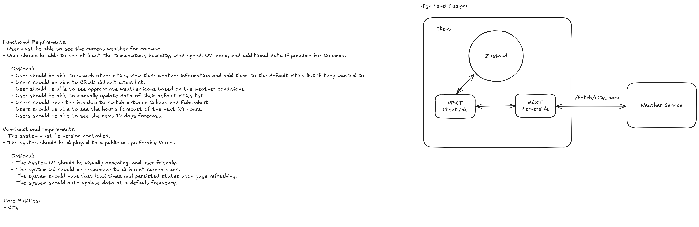

# Weather Now
Weather now is an alternative to the Non-Mac users who are looking for a weather app on web similar to the one on the Mac/iphone.

# Tech Stack
- Next.js 15
- TypeScript
- Tailwind CSS
- Zustand
- tRPC
- React Query
- Jest
- Cypress
- Vercel
- PostHog

# Requirements
## Functional Requirements
- User must be able to see the current weather for colombo.
- User should be able to see at least the temperature, humidity, wind speed, UV index, and additional data if possible for Colombo.

    Optional:
    - User should be able to search other cities, view their weather information and add them to the default cities list if they wanted to.
    - Users should be able to CRUD default cities list.
    - User should be able to see appropriate weather icons based on the weather conditions.
    - User should be able to manually update data of their default cities list.
    - Users should have the freedom to switch between Celsius and Fahrenheit.
    - Users should be able to see the hourly forecast of the next 24 hours.
    - Users should be able to see the next 10 days forecast.

## Non-functional requirements
- The system must be version controlled.
- The system should be deployed to a public url, preferably Vercel.

    Optional:
    - The System UI should be visually appealing, and user friendly.
    - The system UI should be responsive to different screen sizes.
    - The system should have fast load times and persisted states upon page refreshing.
    - The system should auto update data at a default frequency.

# License
This project is licensed under the MIT License.
